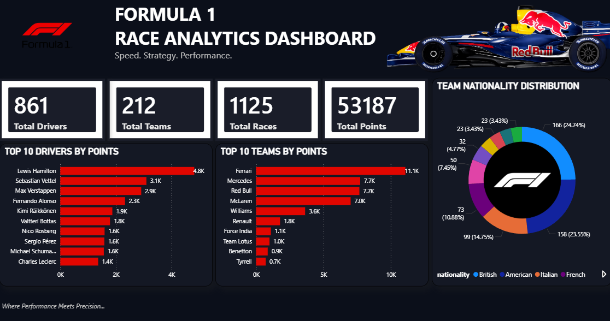

# 🏎️ Formula 1 Race Analytics Dashboard

## 📸 Dashboard Preview



## 📌 Project Overview

The **Formula 1 Race Analytics Dashboard** is an interactive Power BI dashboard designed to analyze historical Formula 1 racing data. The dashboard provides insights into drivers, constructors (teams), races, points, and nationality distributions through visually appealing and interactive charts.

The goal of this project is to transform raw Formula 1 race data into meaningful insights using Power BI's data modeling, DAX calculations, and visualization capabilities.

---

## 🎯 Objectives

* Analyze Formula 1 historical race data.
* Identify top-performing drivers and constructors.
* Visualize team and driver statistics.
* Explore nationality distributions within Formula 1.
* Create a modern and visually appealing dashboard inspired by professional analytics dashboards.

---

## 📊 Dashboard Features

### KPI Cards

* Total Drivers
* Total Teams
* Total Races
* Total Points

### Visualizations

#### 🏁 Top 10 Drivers by Points

Displays the highest-scoring drivers in Formula 1 history.

#### 🏎️ Top 10 Teams by Points

Shows the constructors with the highest accumulated points.

#### 🌍 Team Nationality Distribution

Donut chart representing the distribution of Formula 1 nationalities.

#### 🎨 Custom Dashboard Design

* Dark racing-themed interface
* Formula 1 branding
* F1 car hero image
* Modern card styling
* Consistent red-white-black color palette

---

## 🗂 Dataset Used

The dashboard was built using Formula 1 historical datasets(1950 - 2024) containing:

### Drivers

* Driver ID
* Driver Name
* Nationality

### Constructors

* Constructor ID
* Team Name
* Nationality

### Races

* Race ID
* Race Name
* Year

### Results

* Driver Results
* Constructor Results
* Points
* Positions

### Circuits

* Circuit Information
* Country
* Location

---

## 🛠 Tools & Technologies

* Power BI Desktop
* DAX (Data Analysis Expressions)
* Power Query
* Data Modeling
* CSV Datasets

---

## 📈 Key DAX Measures

### Total Drivers

```DAX
Total Drivers =
DISTINCTCOUNT(Drivers[driverId])
```

### Total Teams

```DAX
Total Teams =
DISTINCTCOUNT(Constructors[constructorId])
```

### Total Races

```DAX
Total Races =
DISTINCTCOUNT(Races[raceId])
```

### Total Points

```DAX
Total Points =
SUM(Results[points])
```

### Driver Total Points

```DAX
Driver Total Points =
SUM(Results[points])
```

### Constructor Total Points

```DAX
Constructor Total Points =
SUM(Results[points])
```

### Driver Count

```DAX
Driver Count =
DISTINCTCOUNT(Drivers[driverId])
```

---

## 🔗 Data Model

The dashboard uses a relational model with the following relationships:

* Drivers ↔ Results
* Constructors ↔ Results
* Races ↔ Results

Relationships were created using primary and foreign keys to enable accurate aggregations and filtering.

---

## 📷 Dashboard Preview

### Main Dashboard

Features:

* Formula 1 themed design
* KPI cards
* Top Drivers Analysis
* Top Teams Analysis
* Nationality Distribution

---

## 🚀 Future Enhancements

* Year-wise race trend analysis
* Driver performance comparison
* Constructor championship analysis
* Interactive slicers and filters
* Circuit-wise race insights
* Driver nationality map visualization

---

## 📚 Learning Outcomes

Through this project, I gained hands-on experience in:

* Data cleaning and transformation
* Power BI dashboard development
* Data modeling and relationships
* DAX calculations and measures
* Dashboard design principles
* Data storytelling and visualization

---

## 🏆 Conclusion

This dashboard demonstrates how Power BI can be used to convert raw Formula 1 racing data into actionable insights through effective data modeling, DAX calculations, and visually engaging analytics.

> **Driven by Speed. Defined by Data.** 🏎️📊
